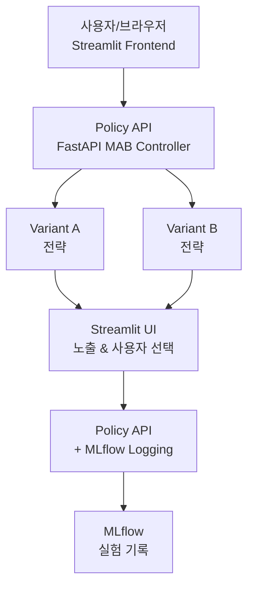

# ABTEST-STREAMIT-movie

Streamlit + FastAPI 기반의 A/B 테스트 및 MAB(Multi-Armed Bandit) 실험 데모 프로젝트입니다.
오프라인 데이터로 주기적인 실험을 수행하고, 실제 사용자 클릭 로그를 받아 MLflow에 기록하여 A/B 테스트와 MAB의 최적화 추이를 비교 및 시각화합니다.

## 📁 프로젝트 구조

```
app/                 # FastAPI 기반의 API
client/              # Streamlit 사용자 UI
analysis/            # 오프라인 분석 스크립트
offline/             # 데이터 및 시뮬레이션 관련 파일
variants/            # A/B 테스트 및 MAB 전략 정의
docker/              # Docker 관련 파일 (선택 사항)
.env.example         # 환경 변수 템플릿
requirements.txt     # Python 의존성 목록
pipeline.txt         # 파이프라인 아이디어 메모
mlflow.db           # MLflow SQLite 백엔드 DB
```

## 🎯 목표

- 데이터 주기 수집 및 적재 기반으로 A/B 테스트와 MAB 모두를 구동했을 때의 성능 추이 그래프 제공
- **실제 사용자 입력(클릭/선호)**을 받는 Streamlit 사용자 앱 제공
- 관리자 대시보드에서 로그, 실시간 성능, 분석 그래프를 포함하고 MLflow 연동을 통해 실험 거버넌스 확보

## 🏗️ 시스템 아키텍처



### 데이터 흐름

1. **① /choose (user_id, context)** - 사용자가 추천 요청
2. **② arm 선택** - MAB 알고리즘이 최적 전략 선택
3. **③ 결과(아이템 목록)** - 선택된 전략으로 아이템 목록 생성
4. **④ 노출 & 사용자 선택** - UI에서 사용자에게 노출
5. **⑤ /update (arm, reward, meta)** - 사용자 클릭 피드백 전송
6. **⑥ α/β 업데이트** - MAB 파라미터 업데이트
7. **⑦ run 기록(arm, reward, etc.)** - MLflow에 실험 결과 기록

## 🖥️ 컴포넌트 구성

### 로컬 개발 환경
- **Streamlit 사용자 앱**: `client/` (포트 8501)
- **FastAPI Policy API**: `app/` (포트 8000)  
- **MLflow Server**: 로컬 UI (포트 5000) / 백엔드: `mlflow.db` (SQLite)
- **데이터**: `data/` + `offline/` (샘플/시뮬레이션 데이터)
- **분석 대시보드**: `analysis/`

### 확장 배포 옵션
- **Docker Compose**로 API, UI, MLflow 컨테이너 분리
- **Kubernetes**: bandit-policy(Deployment), variants(Deployment), MLflow(Service)
- **모니터링**: MLflow (실험), Prometheus/Grafana (시스템), Loki (로그)

## 👥 사용자 인터페이스

### 1️⃣ 사용자 앱 (Frontend)
- **실제 앱 같은 디자인**: 카드 UI, 아이콘, 최소 색 구성
- **목록 노출 & 클릭**: 추천 목록을 보여주고, 클릭 이벤트만 전송 (내부 로그/그래프는 비노출)
- **API 통신**: `GET /choose`로 추천 목록 요청, `POST /update`로 클릭 이벤트 전달

### 2️⃣ 관리자 대시보드 (Backend)  
- **실시간 성능**: A/B vs MAB 성능 추이 (CTR, 누적 보상, 트래픽 비율)
- **팔(Variant)별 분포**: 톰슨 샘플링의 베타 분포 또는 UCB의 평균/불확실성 곡선
- **로그 & 분석**: 실시간 로그 테이블, 최근 세션, 사용자 세그먼트별 성과
- **MLflow 연동**: 실험, 런, 메트릭 그래프를 연동하여 주기성 트렌드(일/주/월) 분석

## 📊 데이터 전략

### 데이터 타입

#### 오프라인 실험 데이터
- 스케줄러로 주기 처리
- CSV/Parquet 형식으로 누적
- A/B는 50:50 고정, MAB는 실시간 보상으로 동적 트래픽 할당

#### 실사용자 로그  
- Streamlit 사용자 앱 클릭 이벤트
- `user_id`, `arm`, `item_id`, `reward(0/1)`, `timestamp`, `context` 정보 포함
- MLflow 및 로컬 DB에 중복 기록 (분석 안정성 확보)

### 추천 공개 데이터셋
- **MovieLens 100K/1M**: 영화/장르/평점 기반 CTR 시뮬레이션
- **Goodbooks-10k**: 도서 추천 (아이템 수 적당)  
- **MIND(News) Small**: 뉴스 CTR (클릭 로그 구조가 적합)

## 🚀 빠른 시작

### 1. 환경 설정
```bash
# 환경 변수 복사 및 설정
cp .env.example .env
# 필요시 PORT/API_BASE/MLFLOW_TRACKING_URI/ARTIFACT_PATH 등 수정
```

### 2. 의존성 설치  
```bash
pip install -r requirements.txt
```

### 3. MLflow 서버 실행
```bash
mlflow ui --backend-store-uri sqlite:///mlflow.db --port 5000
```

### 4. FastAPI 서버 실행
```bash
uvicorn app.main:app --host 127.0.0.1 --port 8000 --reload
```

### 5. Streamlit 앱 실행
```bash
streamlit run client/streamlit_app.py --server.port 8501
```

## 🔬 실험 모드

### A/B Test
- **트래픽**: A:B = 50:50 (고정)
- **메트릭**: CTR, 누적 클릭, 세션당 보상
- **대시보드**: A/B 성능 비교 라인 차트, 누적 차이(CUSUM)

### MAB (Multi-Armed Bandit)
- **트래픽**: 보상 추정이 높은 arm에 동적 할당
- **메트릭**: CTR, 누적 보상, Regret  
- **대시보드**: 팔별 베타분포 변화, 평균+상한 추이

## 📈 API 사양

### GET /choose
**요청**: `GET /choose?user_id=U&context=...`

**응답**:
```json
{
  "arm": "A",
  "items": [
    {
      "item_id": "movie_123", 
      "title": "영화 제목",
      "genre": "액션"
    }
  ]
}
```

### POST /update  
**요청 바디**:
```json
{
  "user_id": "user_123",
  "arm": "A", 
  "item_id": "movie_123",
  "reward": 1,
  "ts": "2024-01-01T12:00:00Z",
  "meta": {"genre": "액션"}
}
```

**효과**: 팔 파라미터 갱신 (Thompson: α/β, UCB: 평균/카운트), MLflow 로깅

## 📊 MLflow & 로깅

- **실시간 로깅**: `/update` 수신 시 MLflow `log_metric`, `log_param` 즉시 기록
- **실험 구조**: Experiment는 `abtest_movielens` 등, Run은 일자/세션/전략 조합
- **대시보드**: 로컬 테이블/캐시로 최근 이벤트 확인, MLflow 메트릭(일/주/월) 라인 차트, Variant별 성능 분포 히스토그램/ECDF

## ⏰ 데이터 스케줄링

- **오프라인 시뮬**: 1~5분 간격으로 세션 배치 생성
- **실사용자 이벤트**: 실시간 수집  
- **집계 잡**: 5~10분 간격으로 CTR/Regret/트래픽 비율 요약 → MLflow 및 로컬 기록
- **중장기 리포팅**: 하루 1회, 주 1회 스냅샷

## 📊 시각화 대시보드

- **A/B vs MAB 누적보상/CTR**: 시간 라인 차트
- **베타분포 스냅샷(Thompson)**: 팔별 PDF (선택 시점/애니메이션)
- **세그먼트별 성과**: 장르/카테고리/신작 여부/가격대
- **트래픽 할당 비율**: 스택 영역 차트
- **Regret**: 누적/구간 Regret

## 🗺️ 로드맵

- [ ] Thompson + UCB 컨트롤러 공용 인터페이스 정리
- [ ] Cold-start 최소 노출 보장 (ε-greedy/softmax 혼합)
- [ ] 세그먼트 MAB (컨텍스트 밴딧) 옵션
- [ ] MLflow Model Registry 이용해 router/PolicyA/PolicyB alias 운영
- [ ] Docker Compose 배포 템플릿
- [ ] Kubernetes 예시 Manifests + HPA
- [ ] Prometheus/Grafana/Loki 연동 문서화

## 💡 개발/운영 팁

- **실험 설계**: 오프라인 점수가 높아도 온라인 CTR이 낮을 수 있으니, A/B 테스트를 거쳐 MAB로 확장하는 전략이 좋습니다.
- **로그 일관성**: Streamlit 캐시/세션 상태와 서버 로그가 이중화되도록 설계하여 데이터 유실을 방지합니다.
- **재현성**: MLflow run에 코드 버전, 파라미터, 데이터 스냅샷 경로를 기록해 실험의 재현성을 높입니다.

## ✅ 실행 체크리스트

1. [ ] `.env` 파일 생성 및 포트/URI 설정
2. [ ] `pip install -r requirements.txt`  
3. [ ] `mlflow ui` 기동 (`mlflow.db` 경로 확인)
4. [ ] `uvicorn app.main:app --port 8000`
5. [ ] `streamlit run client/streamlit_app.py --server.port 8501`
6. [ ] 관리자 페이지에서 메트릭 표/그래프 확인 (A/B/MAB 토글)

## 📄 라이선스

- 내부 코드 및 설정은 본 레포지토리 참조
- 데이터셋 라이선스는 원출처를 반드시 확인 후 사용

---

## 🏃‍♂️ 처음 시작하시나요?

1. **환경 설정**: `.env` 파일을 먼저 설정하세요
2. **의존성 설치**: `requirements.txt`의 패키지들을 설치하세요  
3. **서비스 순서**: MLflow → FastAPI → Streamlit 순으로 실행하세요
4. **확인**: 브라우저에서 각 포트(5000, 8000, 8501)를 확인하세요

문제가 있으시면 Issues에 등록해주세요! 🙋‍♂️